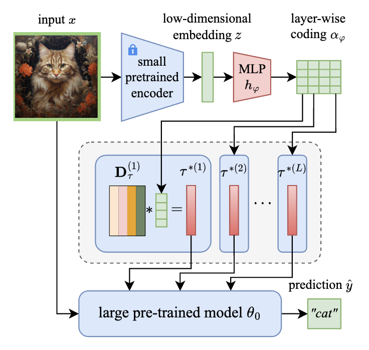

# Data-Adaptive Weight-Ensembling for Multi-Task Model Fusion

setup environment

```bash
# you can replace the name `fusion` with any name you like
conda create --name fusion python=3.11
conda activate fusion
pip install -r requirements.txt # x86-64 Linux
```

<p align="center">
    
</p>


## Experiments

**the checkpoints from our expriments will be available on GitHub after the double-blind review process. The results csv files are in the [`results`](results) directory**

### Multi-task model fusion on CLIP models

- task-wise: `scripts/clip_task_wise_dict.py`
- layer-wise: `scripts/clip_layer_wise_dict.py`

options:

- `version`: version of the experiment, e.g., `version=1`. The results will be saved in `results/{model}/{task,layer}_wise_dict/version_1`.
- `model`: the CLIP model to use, e.g., `model=ViT-B-32`. We use `ViT-B-32` and `ViT-L-14` for CLIP models.
- `dict_feature_extractor`: the feature extractor for the dictionary. We use `microsoft/resnet-18` and `microsoft/resnet-50` for CLIP models.
- `lr`: learning rate for test-time adaptation.
- `batch_size`: batch size for training and evaluation.
- `forward_devices`: the devices to use for forward pass. We use `forward_devices=[1,2,3,4]` for CLIP-ViT-L/14 models during TTA phase.
- `eval_dict_tta`: whether to use test-time adapation to learn the dictionary.
- `eval_dict`: whether to evaluate the model.

for CLIP-ViT-B/32:

```bash
# Test-time adaptation
python scripts/clip_task_wise_dict.py version=1 \
        batch_size=16 \
        eval_dict_tta=true eval_dict=false \
        dict_feature_extractor=microsoft/resnet-50

# Evaluate
python scripts/clip_task_wise_dict.py batch_size=16 version=1 \
        forward_devices=cuda task_vector_device=cuda \
        eval_dict_tta=false eval_dict=true \
        dict_feature_extractor=microsoft/resnet-50
```

for CLIP-ViT-L/14:

```bash
# Test-time adaptation
python scripts/clip_task_wise_dict.py version=3 \
    batch_size=16 \
    eval_dict_tta=true eval_dict=false \
    dict_feature_extractor=microsoft/resnet-50 \
    forward_devices=\[1,2,3,4\] \
    model=ViT-L-14

# Evaluation
python scripts/clip_task_wise_dict.py version=3 \
    batch_size=16 \
    eval_dict_tta=false eval_dict=true \
    dict_feature_extractor=microsoft/resnet-50 \
    model=ViT-L-14
```

substitute `clip_task_wise_dict.py` with `clip_layer_wise_dict.py` for layer-wise fusion.

### Multi-task model fusion on Flan-T5 models

We use [sentenceTransformer](https://huggingface.co/sentence-transformers) to extract the text embeddings.

for Flan-T5-base:

```bash
# Test-time adaptation
python scripts/flan_t5_task_wise_dict.py version=3 \
    batch_size=8 lr=5e-6 \
    dict_feature_extractor=msmarco-MiniLM-L12-cos-v5 \
    eval_dict_tta=true eval_dict=false

# Evaluation
python scripts/flan_t5_task_wise_dict.py version=3 \
    batch_size=8 \
    dict_feature_extractor=msmarco-MiniLM-L12-cos-v5 \
    eval_dict_tta=false eval_dict=true
```

for flan-t5-large:

```bash
# Test-time adaptation
python scripts/flan_t5_task_wise_dict.py version=3 \
    batch_size=8 lr=5e-6 \
    dict_feature_extractor=msmarco-MiniLM-L12-cos-v5 \
    models=flan-t5-large \
    forward_devices="[1,2,3,4]" \
    eval_dict_tta=true eval_dict=false

# Evaluation
python scripts/flan_t5_task_wise_dict.py version=3 \
    batch_size=8 \
    dict_feature_extractor=msmarco-MiniLM-L12-cos-v5 \
    models=flan-t5-large \
    eval_dict_tta=false eval_dict=true
```

### Zero-shot hypernetwork transfer

By runing the above scripts, you will get the following results: `results/{model}/{task,layer}_wise_dict/version_{version}/checkpoints/dict_mapping_step={step}.pt`: the dictionary mapping at step `step`.
Just copy the checkpoints directory to another directory, and run the evaluation script.

for example, for CLIP-ViT-B/32 (task-wise):

```bash
# Test-time adaptation on CLIP-ViT-B/32 models
python scripts/clip_task_wise_dict.py version=1 \
        batch_size=16 \
        eval_dict_tta=true eval_dict=false \
        dict_feature_extractor=microsoft/resnet-50
```

we can copy the checkpoints directory `results/ViT-B-32/task_wise_dict/version_1/checkpoints` to `results/ViT-L-14/task_wise_dict/version_1/checkpoints` and run the evaluation script:

```bash
# Evaluation on CLIP-ViT-L/14 models
python scripts/clip_task_wise_dict.py version=1 \
        batch_size=16 \
        eval_dict_tta=false eval_dict=true \
        dict_feature_extractor=microsoft/resnet-50
```
